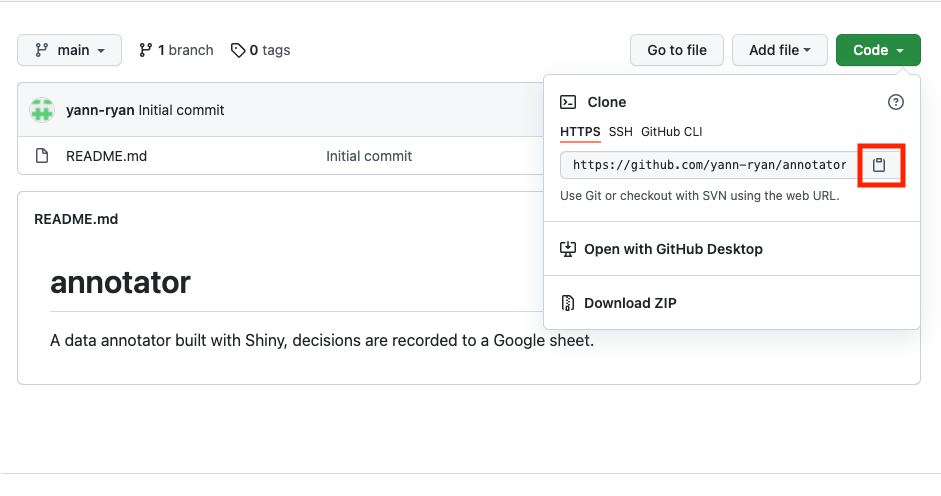
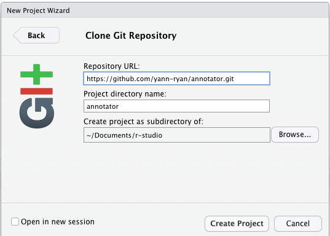

# Annotator

Originally custom-built to annotate letters as part of my Folger Fellowship, I realised it might be useful as a lightweight general annotator for data, for example for machine learning labelling. I like using Google sheets because it records every change made in its history, plus multiple people can work on the same document. You can also manually make changes to the data - the annotator doesn't care. It has a graphic display telling you how many rows of data are labelled and yet to be labelled.

It's also open source, and you can download and edit the source code as much as you like, adding in different buttons or notes fields, and so forth.

While a demo is available here, I advise building your own version by cloning this repository and opening with R-Studio.

It needs an input csv with two columns: a unique key for each row, and the text for the thing to be labelled. This can contain HTML.

You need your own Google sheets API key, which is free to obtain and use. Instructions on this below.

You'll also need to create a Google sheet on google drive, and point the application to it.

## Clone the repository and open in R-Studio

The first step is to get a copy of the annotator running on your local machine. You can, if you want, publish it to your own shinyapps.io account (or other Shiny server), but if you're the only one using it, running it on your own machine will be fine.

#### Download R-Studio

If you don't already have it, you need to download R and R-Studio to run this on your local machine or publish to your own Shiny server. There are very straightforward instructions to do this here: <https://rstudio-education.github.io/hopr/starting.html>

#### Clone the repository to your own machine and open in RStudio.

There are few ways to do this. The 'best' way is to connect your copy of R-studio to Git using the instructions here: <https://happygitwithr.com/>, then 'fork' this repository to your own account, and finally open it in R-Studio. If this all makes sense to you, you probably don't need my step-by-step instructions.

A second method is to 'clone' this repository to R-Studio. This is pretty straightforward.

First, click on the green 'code' button above, and click on the highlighted icon to copy the web address for this repository to your clipboard.

Next, open R-Studio. Click on File-\> New Project-\> Version Control-\>Git

Paste the repository URL into the first text box, and click 'Create Project'. It should download all the code in this repository, including the application.

## Run the application

The application is a short code document, contained within the 'annotator' folder. All the files and folders in the repository can be seen in the bottom-right panel of R-Studio. Open the annotator folder, and then click on the 'app.R. file. It'll open the code in the top-left panel.

If this is the first time you've used R-Studio, you'll probably see a prompt asking you to install missing libraries. Go ahead and do this. When you've finished, run the application using the 'Run App' button at the top of the main panel. It'll open in a minimal web browser by default. I recommend clicking the 'open in browser' link to open in your default browser (Chrome/Firefox etc.)

## Use the application.

When you first open the annotator, you'll see a lot of red error text. This is because it needs three things from you first:

-   A .json file with your personal Google sheets API key
-   A data file containing the thing to be labelled.
-   A link to a new Google spreadsheet

#### Getting an API key from Google

The trickiest bit now is authorising your copy of the application to read and write from a Google sheet on your account. For this you'll need a Google Cloud Platform account and a service account token, in the form of a json file.

There are very good instructions on how to do this here: <https://gargle.r-lib.org/articles/get-api-credentials.html>

Go to <https://console.cloud.google.com>. Make an account as prompted, and create a new project, specifically for the annotator.

Next, enable the Google sheets API. In the sidebar, go to APIs & Services \> Library. Search for 'google sheets', and click enable.

Create an API key. Navigate to APIs & Services \> Credentials. Click Create credentials-\> API key.

You can close this pop-up.

#### Creating and downloading the .json file.

From <https://gargle.r-lib.org/articles/get-api-credentials.html>:

From the Cloud Console, with the correct project selected, got to IAM & Admin-\> Service Accounts.

Do 'Create Service Account, and give it a name and description.

Grant the service account editor access to the project, using the *select a role* drop-down.

Click on the newly-created service account, go to the 'keys' tab, and 'add key', specifying .json format.

Keep this key safe, like a username and password.

#### Upload the json file to the application.

Using the first upload option.

#### Upload a data file.

This is pretty straightforward. Prepare whatever data you'd like to label in a spreadsheet with two columns, a unique key, and a column with the relevant data. This column can take HTML, so you can build quite sophisticated interfaces. Upload this file using the second upload prompt.

#### Provide a link to a Google sheet.

Next, you need to tell the application where to write the decisions you make. Open <https://docs.google.com/spreadsheets>, and create a new spreadsheet (there's a big plus sign on the bottom-right of the screen). Give it a name.

If your data has more than 1000 rows, you'll need to add space for more annotations. Do this by scrolling to the bottom of the sheet and clicking the 'Add X more rows at bottom' button.

Click on the green 'Share' button. Under the 'Get Link' option, click 'Change to anyone with the link'. Change this to editor, and then 'copy link'.

Paste this link into the 'Sheet key' prompt, and click *Load Sheet*

#### Enter some data for the first item.

Because of some quirks in the application and the way it reads Google sheets, the display won't work until you've filled in something for the first record, in all fields.

To do this, add some text to both notes fields, and click any one of the decision buttons.

## Using the annotator.

Everything should now be set up. The annotator is built to quickly add notes to data, one at a time.

There are three main areas.

-   First, a set of controls allowing you to make a decision, add notes, or skip to a particular entry.
-   In the middle, the text of the thing you're annotating, plus any existing decisions and notes.
-   On the right, a GUI showing the current status of each row.

You can enter just a decision (yes, no, maybe), or add notes into one or both of the notes fields.

Once you've made a decision, the annotator will automatically move on to the next row in the spreadsheet, and write the decision and whatever is in the notes field to the Google sheet, along with the key for that piece of data.

NB: at the moment, the notes field will stay filled once you move onto the next item. This means that unless you delete the text from the box, it'll continue to write that same text to every row as you click the decision buttons.

Conversely, if you go back to a row and make a new decision, any existing notes will be overwritten, even if it's blank. So if you change a decision, copy and paste the notes back from the 'Existing details' information.

#### The GUI

This grid has some basic interactivity. Hover over a cell to show a preview of its text underneath the grid. Click on a cell to jump to that row in the data.

#### Check that everything is writing correctly to Google sheets.

I recommend keeping google Sheets open, which will allow you to see exactly what is being written to it.

## Making changes to the source code

If you run your own copy on a local server, it's trivially easy to make changes to the underlying source code using R and Shiny.

For example, changing the labels on the buttons can be done just by editing the text highlighted below, from lines 35-36 of the code:

You can also change the text written to the Google sheet with each button. The first argument of each `actionBttn` is its name and has a corresponding `observeEvent` in the code, preceded by `input$`. For example, the first actionBtton, `yes`, has an observeEvent at lines 159-165. This essentially says, if the button 'yes' is pressed, execute the following code. The code itself is:

    observeEvent(input$yes, {
            
            
            data = tibble(data_to_label()$key[counter$countervalue],'yes', input$places, input$text)
            range_write(sheet_key(), data, sheet = 1, range = paste0("A", counter$countervalue), col_names = F)
            counter$countervalue <- counter$countervalue + 1
        })
        

The value 'yes' (the second argument) is written to the Google sheet in the relevant cell, any time that button is pressed. This could be changed to any other text string.

It is also easy to add more buttons. Just copy and paste one of the `actionBttn` functions and add it below an existing one. Give it a new name and label. Then, copy and paste one of the observeEvents too, changing the text (where 'yes' is) and the input$yes to input$whatever you've put as the first argument.

So to add an additional button that allows users to mark data as faulty:

First, add this line to the UI part of the code:

Next, add an additional observeEvent somewhere in the app part of the code:

